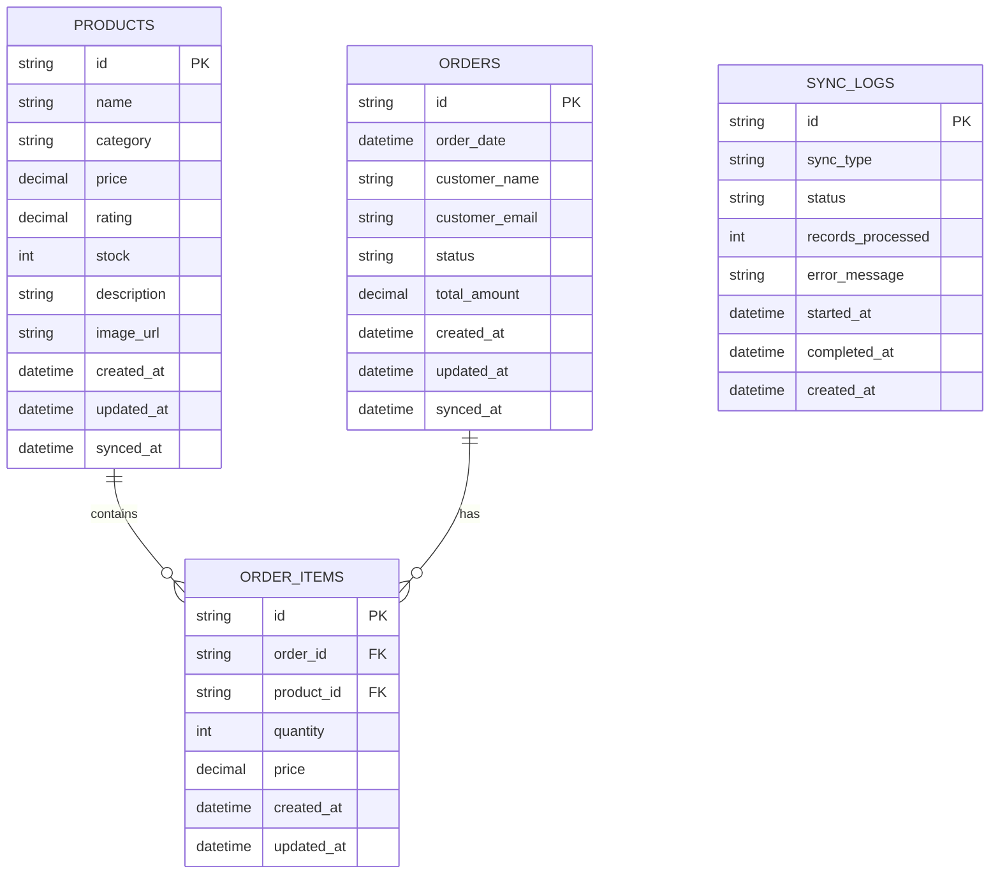

# E-commerce Analytics System - ERD (Entity Relationship Diagram)

## Mermaid Diagram



## Database Schema Design

### 1. Products Table
Stores product information from the e-commerce API.

```
products
- id (String, PK) - Unique product identifier
- name (String) - Product name
- category (String) - Product category
- price (Decimal) - Product price
- rating (Decimal, nullable) - Average product rating
- stock (Int, nullable) - Stock quantity
- description (String, nullable) - Product description
- image_url (String, nullable) - Product image URL
- created_at (DateTime) - Record creation timestamp
- updated_at (DateTime) - Record last update timestamp
- synced_at (DateTime) - Last sync timestamp from API
```

### 2. Orders Table
Stores order information from the e-commerce API.

```
orders
- id (String, PK) - Unique order identifier
- order_date (DateTime) - When the order was placed
- customer_name (String) - Customer name
- customer_email (String, nullable) - Customer email
- status (String) - Order status (pending, completed, cancelled, processing)
- total_amount (Decimal) - Total order amount
- created_at (DateTime) - Record creation timestamp
- updated_at (DateTime) - Record last update timestamp
- synced_at (DateTime) - Last sync timestamp from API
```

### 3. Order Items Table
Stores individual items within each order (Many-to-Many relationship between Orders and Products).

```
order_items
- id (String, PK) - Unique order item identifier
- order_id (String, FK) - References orders.id
- product_id (String, FK) - References products.id
- quantity (Int) - Quantity ordered
- price (Decimal) - Price at the time of order
- created_at (DateTime) - Record creation timestamp
- updated_at (DateTime) - Record last update timestamp
```

### 4. Sync Logs Table (Optional)
Tracks synchronization history for monitoring and debugging.

```
sync_logs
- id (String, PK) - Unique log identifier
- sync_type (String) - Type of sync (products, orders)
- status (String) - Sync status (success, failed, partial)
- records_processed (Int) - Number of records processed
- error_message (String, nullable) - Error details if failed
- started_at (DateTime) - Sync start time
- completed_at (DateTime, nullable) - Sync completion time
- created_at (DateTime) - Record creation timestamp
```

## Entity Relationships

```
Products (1) ──< (Many) Order Items (Many) >── (1) Orders
```

- One Product can appear in many Order Items
- One Order can have many Order Items
- Order Items acts as a junction table connecting Products and Orders

## Indexes

For optimal query performance:

1. `products.category` - For category grouping queries
2. `orders.status` - For status grouping queries
3. `orders.order_date` - For date range filtering
4. `order_items.order_id` - For order lookup
5. `order_items.product_id` - For product lookup

## Key Design Decisions

1. **Separate Order Items Table**: Maintains proper normalization and allows tracking of historical prices even if product prices change
2. **Timestamp Fields**: Three types of timestamps:
   - `created_at`: Initial record creation
   - `updated_at`: Last modification
   - `synced_at`: Last API sync (for tracking data freshness)
3. **String IDs**: Using String type for IDs to accommodate various ID formats from external APIs
4. **Decimal for Money**: Using Decimal type for prices and amounts to avoid floating-point precision issues
5. **Sync Logs**: Optional table for monitoring sync job health and debugging issues

## Sample Prisma Schema

```prisma
// prisma/schema.prisma
generator client {
  provider = "prisma-client-js"
}

datasource db {
  provider = "postgresql"
  url      = env("DATABASE_URL")
}

model Product {
  id          String      @id @default(uuid())
  name        String
  category    String
  price       Decimal     @db.Decimal(10, 2)
  rating      Decimal?    @db.Decimal(3, 2)
  stock       Int?
  description String?     @db.Text
  imageUrl    String?     @map("image_url")

  createdAt   DateTime    @default(now()) @map("created_at")
  updatedAt   DateTime    @updatedAt @map("updated_at")
  syncedAt    DateTime    @default(now()) @map("synced_at")

  orderItems  OrderItem[]

  @@index([category])
  @@map("products")
}

model Order {
  id            String      @id @default(uuid())
  orderDate     DateTime    @map("order_date")
  customerName  String      @map("customer_name")
  customerEmail String?     @map("customer_email")
  status        String
  totalAmount   Decimal     @db.Decimal(10, 2) @map("total_amount")

  createdAt     DateTime    @default(now()) @map("created_at")
  updatedAt     DateTime    @updatedAt @map("updated_at")
  syncedAt      DateTime    @default(now()) @map("synced_at")

  orderItems    OrderItem[]

  @@index([status])
  @@index([orderDate])
  @@map("orders")
}

model OrderItem {
  id        String   @id @default(uuid())
  orderId   String   @map("order_id")
  productId String   @map("product_id")
  quantity  Int
  price     Decimal  @db.Decimal(10, 2)

  createdAt DateTime @default(now()) @map("created_at")
  updatedAt DateTime @updatedAt @map("updated_at")

  order     Order    @relation(fields: [orderId], references: [id], onDelete: Cascade)
  product   Product  @relation(fields: [productId], references: [id], onDelete: Cascade)

  @@index([orderId])
  @@index([productId])
  @@map("order_items")
}

model SyncLog {
  id               String    @id @default(uuid())
  syncType         String    @map("sync_type")
  status           String
  recordsProcessed Int       @map("records_processed")
  errorMessage     String?   @db.Text @map("error_message")
  startedAt        DateTime  @map("started_at")
  completedAt      DateTime? @map("completed_at")

  createdAt        DateTime  @default(now()) @map("created_at")

  @@map("sync_logs")
}
```
